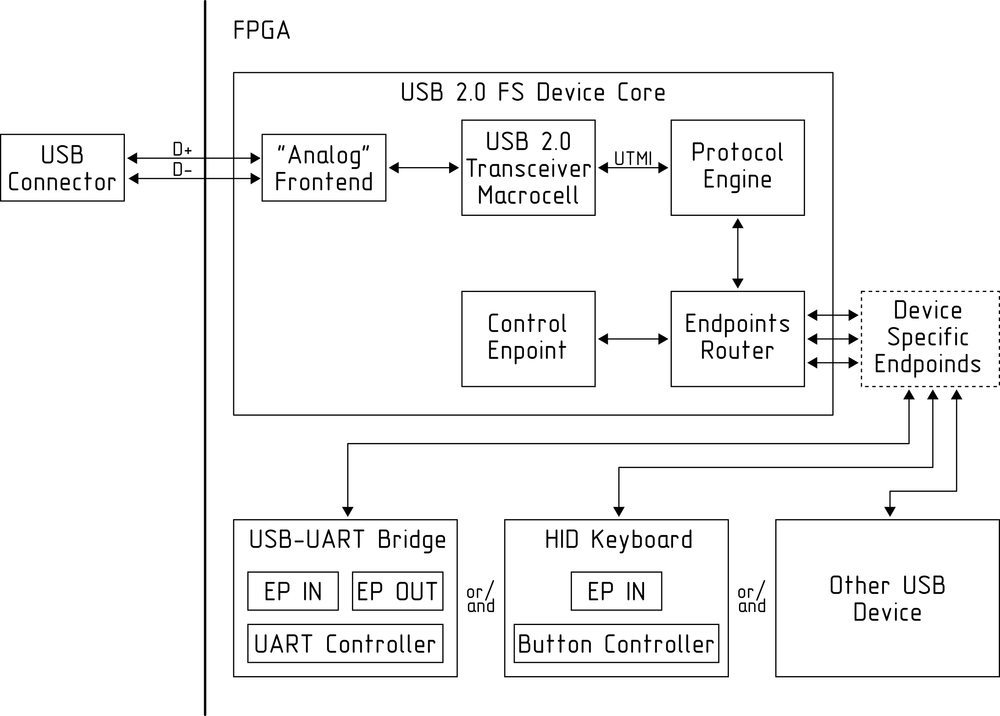

# USB 2.0 FS Device controller IP core

**usb20dev** is an open source IP core written in SystemVerilog for interfacing USB without any external chips.
The main idea is just to route USB signals directly to FPGA and use usual tri-state IO as "analog" frontend. Yes, this will be outside of the USB specs, but should work. And USB 2.0 full-speed (12Mbps) is the maximum we can achieve by this way.

## Functional blocks

**NOT STABLE - CONSISTENCE OF THE CODE/DESCRIPTION/OTHER INFORMATION MAY BE BROKEN**

* **"Analog" Frontend (FE)** : Two generic 3.3V tri-state IO
* **USB 2.0 Transceiver Macrocell (UTM)** :
    * Bit stuffing / unstuffing
    * NRZI encoding / decoding
    * SYNC and EOP handling
    * Serial-Parallel/ Parallel-Serial Conversion
* **Protocol Engine (PE)** :
    * Packet recognition
    * Transaction sequencing
    * CRC generation and checking
    * Packet ID (PID) generation and checking/decoding
* **Endpoints Router (EPR)** : Endpoints routing
* **Control Endpoint (EP0)** : Endpoint 0 IN and Endpoint 0 OUT
* **Device Specific Endpoinds** : All other user application endpoints

